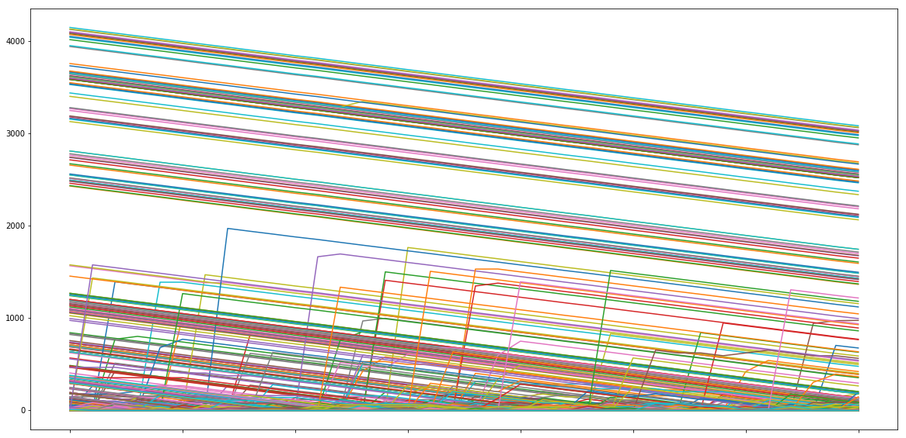
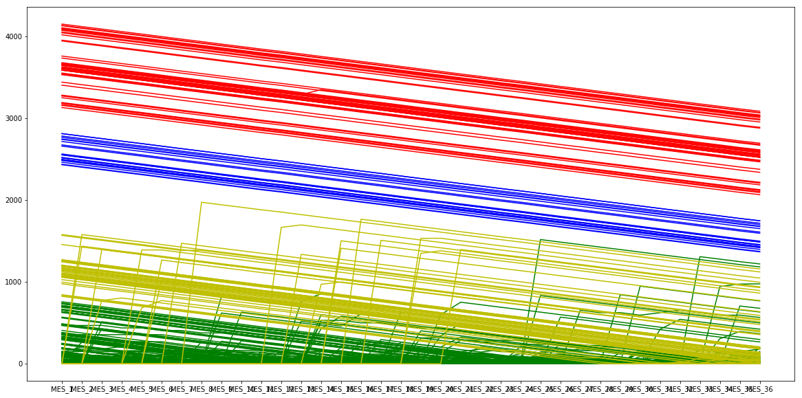
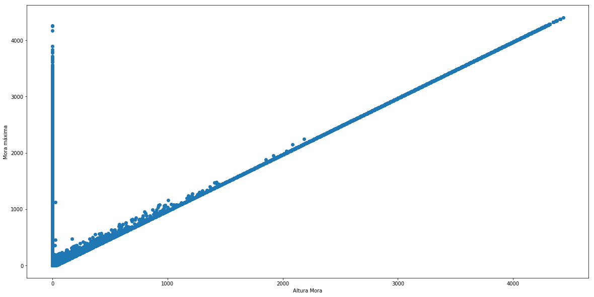
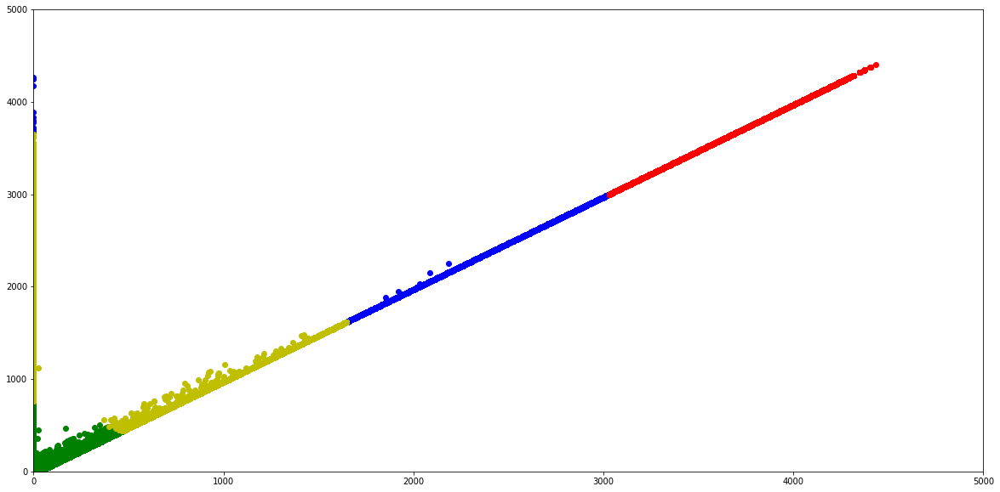

```python
import pandas as pd
import numpy as np
import matplotlib.pyplot as plt
```

# Cargamos los datos


```python
data = pd.read_csv("FinancialBehavior.csv",
                index_col = 0)
data.shape
```

    /home/luis/anaconda3/lib/python3.7/site-packages/numpy/lib/arraysetops.py:522: FutureWarning: elementwise comparison failed; returning scalar instead, but in the future will perform elementwise comparison
      mask |= (ar1 == a)


    (2488193, 42)


Los datos son muy grandes y tuve problemas con la memoria RAM, así que sólo utilicé la mitad


```python
data = data.iloc[:1244096, :]
data.shape
```


    (1244096, 42)


```python
data.head()
```


<div>
<style scoped>
    .dataframe tbody tr th:only-of-type {
        vertical-align: middle;
    }

    .dataframe tbody tr th {
        vertical-align: top;
    }

    .dataframe thead th {
        text-align: right;
    }
</style>
<table border="1" class="dataframe">
  <thead>
    <tr style="text-align: right;">
      <th></th>
      <th>PROV_CUENTA</th>
      <th>PROV_TIPO_DOCUMENTO</th>
      <th>PROV_NUM_DOCUMENTO</th>
      <th>PROV_FEC_APER</th>
      <th>ALTURA_MORA</th>
      <th>MORA_MAXIMA</th>
      <th>MES_1</th>
      <th>MES_2</th>
      <th>MES_3</th>
      <th>MES_4</th>
      <th>...</th>
      <th>MES_27</th>
      <th>MES_28</th>
      <th>MES_29</th>
      <th>MES_30</th>
      <th>MES_31</th>
      <th>MES_32</th>
      <th>MES_33</th>
      <th>MES_34</th>
      <th>MES_35</th>
      <th>MES_36</th>
    </tr>
  </thead>
  <tbody>
    <tr>
      <th>1</th>
      <td>8228769611</td>
      <td>1</td>
      <td>79611181</td>
      <td>20161006</td>
      <td>0.0</td>
      <td>0.0</td>
      <td>0.0</td>
      <td>0.0</td>
      <td>0.0</td>
      <td>0.0</td>
      <td>...</td>
      <td>-1.0</td>
      <td>-1.0</td>
      <td>-1.0</td>
      <td>-1.0</td>
      <td>-1.0</td>
      <td>-1.0</td>
      <td>-1.0</td>
      <td>-1.0</td>
      <td>-1.0</td>
      <td>-1.0</td>
    </tr>
    <tr>
      <th>2</th>
      <td>8169086811</td>
      <td>1</td>
      <td>52249171</td>
      <td>20140503</td>
      <td>0.0</td>
      <td>0.0</td>
      <td>0.0</td>
      <td>0.0</td>
      <td>0.0</td>
      <td>0.0</td>
      <td>...</td>
      <td>0.0</td>
      <td>0.0</td>
      <td>0.0</td>
      <td>0.0</td>
      <td>0.0</td>
      <td>0.0</td>
      <td>0.0</td>
      <td>0.0</td>
      <td>0.0</td>
      <td>0.0</td>
    </tr>
    <tr>
      <th>3</th>
      <td>8113372805</td>
      <td>1</td>
      <td>93377389</td>
      <td>20110828</td>
      <td>0.0</td>
      <td>0.0</td>
      <td>0.0</td>
      <td>0.0</td>
      <td>0.0</td>
      <td>0.0</td>
      <td>...</td>
      <td>0.0</td>
      <td>0.0</td>
      <td>0.0</td>
      <td>0.0</td>
      <td>0.0</td>
      <td>0.0</td>
      <td>0.0</td>
      <td>0.0</td>
      <td>0.0</td>
      <td>0.0</td>
    </tr>
    <tr>
      <th>4</th>
      <td>8224958500</td>
      <td>1</td>
      <td>1113629973</td>
      <td>20160814</td>
      <td>0.0</td>
      <td>20.0</td>
      <td>0.0</td>
      <td>0.0</td>
      <td>0.0</td>
      <td>0.0</td>
      <td>...</td>
      <td>-1.0</td>
      <td>-1.0</td>
      <td>-1.0</td>
      <td>-1.0</td>
      <td>-1.0</td>
      <td>-1.0</td>
      <td>-1.0</td>
      <td>-1.0</td>
      <td>-1.0</td>
      <td>-1.0</td>
    </tr>
    <tr>
      <th>5</th>
      <td>8237356206</td>
      <td>1</td>
      <td>51652333</td>
      <td>20170127</td>
      <td>0.0</td>
      <td>0.0</td>
      <td>0.0</td>
      <td>0.0</td>
      <td>0.0</td>
      <td>0.0</td>
      <td>...</td>
      <td>-1.0</td>
      <td>-1.0</td>
      <td>-1.0</td>
      <td>-1.0</td>
      <td>-1.0</td>
      <td>-1.0</td>
      <td>-1.0</td>
      <td>-1.0</td>
      <td>-1.0</td>
      <td>-1.0</td>
    </tr>
  </tbody>
</table>
<p>5 rows × 42 columns</p>
</div>


Quité las columnas que no necesitaba


```python
data = data.drop(["PROV_CUENTA"], axis = 1)
data = data.drop("PROV_TIPO_DOCUMENTO", axis = 1)
data = data.drop("PROV_NUM_DOCUMENTO",axis = 1)
data = data.drop("PROV_FEC_APER",axis = 1)
```


```python
data.head()
```


<div>
<style scoped>
    .dataframe tbody tr th:only-of-type {
        vertical-align: middle;
    }

    .dataframe tbody tr th {
        vertical-align: top;
    }

    .dataframe thead th {
        text-align: right;
    }
</style>
<table border="1" class="dataframe">
  <thead>
    <tr style="text-align: right;">
      <th></th>
      <th>ALTURA_MORA</th>
      <th>MORA_MAXIMA</th>
      <th>MES_1</th>
      <th>MES_2</th>
      <th>MES_3</th>
      <th>MES_4</th>
      <th>MES_5</th>
      <th>MES_6</th>
      <th>MES_7</th>
      <th>MES_8</th>
      <th>...</th>
      <th>MES_27</th>
      <th>MES_28</th>
      <th>MES_29</th>
      <th>MES_30</th>
      <th>MES_31</th>
      <th>MES_32</th>
      <th>MES_33</th>
      <th>MES_34</th>
      <th>MES_35</th>
      <th>MES_36</th>
    </tr>
  </thead>
  <tbody>
    <tr>
      <th>1</th>
      <td>0.0</td>
      <td>0.0</td>
      <td>0.0</td>
      <td>0.0</td>
      <td>0.0</td>
      <td>0.0</td>
      <td>0.0</td>
      <td>0.0</td>
      <td>0.0</td>
      <td>0.0</td>
      <td>...</td>
      <td>-1.0</td>
      <td>-1.0</td>
      <td>-1.0</td>
      <td>-1.0</td>
      <td>-1.0</td>
      <td>-1.0</td>
      <td>-1.0</td>
      <td>-1.0</td>
      <td>-1.0</td>
      <td>-1.0</td>
    </tr>
    <tr>
      <th>2</th>
      <td>0.0</td>
      <td>0.0</td>
      <td>0.0</td>
      <td>0.0</td>
      <td>0.0</td>
      <td>0.0</td>
      <td>0.0</td>
      <td>0.0</td>
      <td>0.0</td>
      <td>0.0</td>
      <td>...</td>
      <td>0.0</td>
      <td>0.0</td>
      <td>0.0</td>
      <td>0.0</td>
      <td>0.0</td>
      <td>0.0</td>
      <td>0.0</td>
      <td>0.0</td>
      <td>0.0</td>
      <td>0.0</td>
    </tr>
    <tr>
      <th>3</th>
      <td>0.0</td>
      <td>0.0</td>
      <td>0.0</td>
      <td>0.0</td>
      <td>0.0</td>
      <td>0.0</td>
      <td>0.0</td>
      <td>0.0</td>
      <td>0.0</td>
      <td>0.0</td>
      <td>...</td>
      <td>0.0</td>
      <td>0.0</td>
      <td>0.0</td>
      <td>0.0</td>
      <td>0.0</td>
      <td>0.0</td>
      <td>0.0</td>
      <td>0.0</td>
      <td>0.0</td>
      <td>0.0</td>
    </tr>
    <tr>
      <th>4</th>
      <td>0.0</td>
      <td>20.0</td>
      <td>0.0</td>
      <td>0.0</td>
      <td>0.0</td>
      <td>0.0</td>
      <td>0.0</td>
      <td>0.0</td>
      <td>0.0</td>
      <td>0.0</td>
      <td>...</td>
      <td>-1.0</td>
      <td>-1.0</td>
      <td>-1.0</td>
      <td>-1.0</td>
      <td>-1.0</td>
      <td>-1.0</td>
      <td>-1.0</td>
      <td>-1.0</td>
      <td>-1.0</td>
      <td>-1.0</td>
    </tr>
    <tr>
      <th>5</th>
      <td>0.0</td>
      <td>0.0</td>
      <td>0.0</td>
      <td>0.0</td>
      <td>0.0</td>
      <td>0.0</td>
      <td>0.0</td>
      <td>0.0</td>
      <td>0.0</td>
      <td>0.0</td>
      <td>...</td>
      <td>-1.0</td>
      <td>-1.0</td>
      <td>-1.0</td>
      <td>-1.0</td>
      <td>-1.0</td>
      <td>-1.0</td>
      <td>-1.0</td>
      <td>-1.0</td>
      <td>-1.0</td>
      <td>-1.0</td>
    </tr>
  </tbody>
</table>
<p>5 rows × 38 columns</p>
</div>


# Análisis exploratorio:
Exploré el data set en dos partes, los meses (vistos como una serie de tiempo) y los datos de altura mora y mora máxima.

## Serie de tiempo:
Cada cuenta tiene la serie de tiempo que indica como ha ido pagando y debiendo el cliente y se muestra en la siguiente gráfica:


```python
data.iloc[2000:5000,2:38].T.plot(figsize=(20,10)).get_legend().remove()
```





Para poder obtener un score con estos datos se utilizó una técnica de clusterización KMeans y para entrenar Kmeans se utilizaron los datos de los meses (data.iloc[:,2:]) y queremos obtener sólamente 4 clusters


```python
from sklearn.cluster import KMeans
kmeans = KMeans(n_clusters=4, random_state=0).fit(data.iloc[:,2:])
```

Se predijeron los datos y se guardaron en una nueva columna llamada "resultado"


```python
result = kmeans.predict(data.iloc[:,2:])
```


```python
data["resultado"] = result + 1
```


```python
data.head()
```


<div>
<style scoped>
    .dataframe tbody tr th:only-of-type {
        vertical-align: middle;
    }

    .dataframe tbody tr th {
        vertical-align: top;
    }

    .dataframe thead th {
        text-align: right;
    }
</style>
<table border="1" class="dataframe">
  <thead>
    <tr style="text-align: right;">
      <th></th>
      <th>ALTURA_MORA</th>
      <th>MORA_MAXIMA</th>
      <th>MES_1</th>
      <th>MES_2</th>
      <th>MES_3</th>
      <th>MES_4</th>
      <th>MES_5</th>
      <th>MES_6</th>
      <th>MES_7</th>
      <th>MES_8</th>
      <th>...</th>
      <th>MES_28</th>
      <th>MES_29</th>
      <th>MES_30</th>
      <th>MES_31</th>
      <th>MES_32</th>
      <th>MES_33</th>
      <th>MES_34</th>
      <th>MES_35</th>
      <th>MES_36</th>
      <th>resultado</th>
    </tr>
  </thead>
  <tbody>
    <tr>
      <th>1</th>
      <td>0.0</td>
      <td>0.0</td>
      <td>0.0</td>
      <td>0.0</td>
      <td>0.0</td>
      <td>0.0</td>
      <td>0.0</td>
      <td>0.0</td>
      <td>0.0</td>
      <td>0.0</td>
      <td>...</td>
      <td>-1.0</td>
      <td>-1.0</td>
      <td>-1.0</td>
      <td>-1.0</td>
      <td>-1.0</td>
      <td>-1.0</td>
      <td>-1.0</td>
      <td>-1.0</td>
      <td>-1.0</td>
      <td>1</td>
    </tr>
    <tr>
      <th>2</th>
      <td>0.0</td>
      <td>0.0</td>
      <td>0.0</td>
      <td>0.0</td>
      <td>0.0</td>
      <td>0.0</td>
      <td>0.0</td>
      <td>0.0</td>
      <td>0.0</td>
      <td>0.0</td>
      <td>...</td>
      <td>0.0</td>
      <td>0.0</td>
      <td>0.0</td>
      <td>0.0</td>
      <td>0.0</td>
      <td>0.0</td>
      <td>0.0</td>
      <td>0.0</td>
      <td>0.0</td>
      <td>1</td>
    </tr>
    <tr>
      <th>3</th>
      <td>0.0</td>
      <td>0.0</td>
      <td>0.0</td>
      <td>0.0</td>
      <td>0.0</td>
      <td>0.0</td>
      <td>0.0</td>
      <td>0.0</td>
      <td>0.0</td>
      <td>0.0</td>
      <td>...</td>
      <td>0.0</td>
      <td>0.0</td>
      <td>0.0</td>
      <td>0.0</td>
      <td>0.0</td>
      <td>0.0</td>
      <td>0.0</td>
      <td>0.0</td>
      <td>0.0</td>
      <td>1</td>
    </tr>
    <tr>
      <th>4</th>
      <td>0.0</td>
      <td>20.0</td>
      <td>0.0</td>
      <td>0.0</td>
      <td>0.0</td>
      <td>0.0</td>
      <td>0.0</td>
      <td>0.0</td>
      <td>0.0</td>
      <td>0.0</td>
      <td>...</td>
      <td>-1.0</td>
      <td>-1.0</td>
      <td>-1.0</td>
      <td>-1.0</td>
      <td>-1.0</td>
      <td>-1.0</td>
      <td>-1.0</td>
      <td>-1.0</td>
      <td>-1.0</td>
      <td>1</td>
    </tr>
    <tr>
      <th>5</th>
      <td>0.0</td>
      <td>0.0</td>
      <td>0.0</td>
      <td>0.0</td>
      <td>0.0</td>
      <td>0.0</td>
      <td>0.0</td>
      <td>0.0</td>
      <td>0.0</td>
      <td>0.0</td>
      <td>...</td>
      <td>-1.0</td>
      <td>-1.0</td>
      <td>-1.0</td>
      <td>-1.0</td>
      <td>-1.0</td>
      <td>-1.0</td>
      <td>-1.0</td>
      <td>-1.0</td>
      <td>-1.0</td>
      <td>1</td>
    </tr>
  </tbody>
</table>
<p>5 rows × 39 columns</p>
</div>


## Grafica

Así es como queda la gráfica después de hacer los clusters, de color verte están los que han pagado menos y más a tiempo y el rojo son los que deben más y se retrasan más


```python
plt.figure(figsize=(20,10))
plt.plot(data.iloc[2000:5000,2:38][(data.iloc[:,38] == 1)].T, color="g")
plt.plot(data.iloc[2000:5000,2:38][(data.iloc[:,38] == 2)].T, color="b")
plt.plot(data.iloc[2000:5000,2:38][(data.iloc[:,38] == 3)].T, color="y")
plt.plot(data.iloc[2000:5000,2:38][(data.iloc[:,38] == 4)].T, color="r")
# d1 = data.iloc[2000:5000,2:38][(data.iloc[:,38] == 1)].T.plot(figsize=(20,10), color='r').get_legend().remove()
# data.iloc[2000:5000,2:38][(data.iloc[:,38] == 1)].T.plot(figsize=(20,10), color='r').get_legend().remove()
```

    /home/luis/anaconda3/lib/python3.7/site-packages/ipykernel_launcher.py:2: UserWarning: Boolean Series key will be reindexed to match DataFrame index.
      
    /home/luis/anaconda3/lib/python3.7/site-packages/ipykernel_launcher.py:3: UserWarning: Boolean Series key will be reindexed to match DataFrame index.
      This is separate from the ipykernel package so we can avoid doing imports until
    /home/luis/anaconda3/lib/python3.7/site-packages/ipykernel_launcher.py:4: UserWarning: Boolean Series key will be reindexed to match DataFrame index.
      after removing the cwd from sys.path.
    /home/luis/anaconda3/lib/python3.7/site-packages/ipykernel_launcher.py:5: UserWarning: Boolean Series key will be reindexed to match DataFrame index.
      """


    [<matplotlib.lines.Line2D at 0x7efc43859be0>,
     <matplotlib.lines.Line2D at 0x7efc43859d68>,
     <matplotlib.lines.Line2D at 0x7efc43859eb8>,
     <matplotlib.lines.Line2D at 0x7efc43902048>,
     <matplotlib.lines.Line2D at 0x7efc43902198>,
     <matplotlib.lines.Line2D at 0x7efc439022e8>,
     <matplotlib.lines.Line2D at 0x7efc43902438>,
     <matplotlib.lines.Line2D at 0x7efc43902588>,
     <matplotlib.lines.Line2D at 0x7efc439026d8>,
     <matplotlib.lines.Line2D at 0x7efc43902828>,
     <matplotlib.lines.Line2D at 0x7efc43902978>,
     <matplotlib.lines.Line2D at 0x7efc43902ac8>,
     <matplotlib.lines.Line2D at 0x7efc43902c18>,
     <matplotlib.lines.Line2D at 0x7efc43902d68>,
     <matplotlib.lines.Line2D at 0x7efc43902eb8>,
     <matplotlib.lines.Line2D at 0x7efc43900048>,
     <matplotlib.lines.Line2D at 0x7efc43900198>,
     <matplotlib.lines.Line2D at 0x7efc439002e8>,
     <matplotlib.lines.Line2D at 0x7efc43900438>,
     <matplotlib.lines.Line2D at 0x7efc43900588>,
     <matplotlib.lines.Line2D at 0x7efc439006d8>,
     <matplotlib.lines.Line2D at 0x7efc43900828>,
     <matplotlib.lines.Line2D at 0x7efc43900978>,
     <matplotlib.lines.Line2D at 0x7efc43900ac8>,
     <matplotlib.lines.Line2D at 0x7efc43900c18>,
     <matplotlib.lines.Line2D at 0x7efc43900d68>,
     <matplotlib.lines.Line2D at 0x7efc43900eb8>,
     <matplotlib.lines.Line2D at 0x7efc438e4048>,
     <matplotlib.lines.Line2D at 0x7efc438e4198>,
     <matplotlib.lines.Line2D at 0x7efc438e42e8>,
     <matplotlib.lines.Line2D at 0x7efc438e4438>,
     <matplotlib.lines.Line2D at 0x7efc438e4588>,
     <matplotlib.lines.Line2D at 0x7efc438e46d8>,
     <matplotlib.lines.Line2D at 0x7efc438e4828>,
     <matplotlib.lines.Line2D at 0x7efc438e4978>,
     <matplotlib.lines.Line2D at 0x7efc438e4ac8>,
     <matplotlib.lines.Line2D at 0x7efc438e4c18>,
     <matplotlib.lines.Line2D at 0x7efc438e4d68>,
     <matplotlib.lines.Line2D at 0x7efc438e4eb8>,
     <matplotlib.lines.Line2D at 0x7efc43952048>,
     <matplotlib.lines.Line2D at 0x7efc43952198>,
     <matplotlib.lines.Line2D at 0x7efc439522e8>,
     <matplotlib.lines.Line2D at 0x7efc43952438>,
     <matplotlib.lines.Line2D at 0x7efc43952588>,
     <matplotlib.lines.Line2D at 0x7efc439526d8>,
     <matplotlib.lines.Line2D at 0x7efc43952828>,
     <matplotlib.lines.Line2D at 0x7efc43952978>,
     <matplotlib.lines.Line2D at 0x7efc43952ac8>,
     <matplotlib.lines.Line2D at 0x7efc43952c18>,
     <matplotlib.lines.Line2D at 0x7efc43952d68>]





## Altura Mora y Mora máxima


```python
data.iloc[:,:2].head()
```


<div>
<style scoped>
    .dataframe tbody tr th:only-of-type {
        vertical-align: middle;
    }

    .dataframe tbody tr th {
        vertical-align: top;
    }

    .dataframe thead th {
        text-align: right;
    }
</style>
<table border="1" class="dataframe">
  <thead>
    <tr style="text-align: right;">
      <th></th>
      <th>ALTURA_MORA</th>
      <th>MORA_MAXIMA</th>
    </tr>
  </thead>
  <tbody>
    <tr>
      <th>1</th>
      <td>0.0</td>
      <td>0.0</td>
    </tr>
    <tr>
      <th>2</th>
      <td>0.0</td>
      <td>0.0</td>
    </tr>
    <tr>
      <th>3</th>
      <td>0.0</td>
      <td>0.0</td>
    </tr>
    <tr>
      <th>4</th>
      <td>0.0</td>
      <td>20.0</td>
    </tr>
    <tr>
      <th>5</th>
      <td>0.0</td>
      <td>0.0</td>
    </tr>
  </tbody>
</table>
</div>


Al graficar Altura Mora y Mora Máxima obtenemos el siguiente resultado, en el que podemos ver que se pueden tener dos patrones, o la Altura Mora incrementa junto con la Mora Máxima o sólo incrementa la Mora Máxima


```python
plt.figure(figsize=(20,10))
plt.xlabel('Altura Mora')
plt.ylabel('Mora máxima')
plt.plot(data.iloc[:,0],data.iloc[:,1],"o")
```


    [<matplotlib.lines.Line2D at 0x7efc48c4e390>]





También vamos a clusterizar estos dos datos con la técnica de KMeans para obtener los que tienen menos deudas y los que tienen menos tiempo debiendo


```python
kmeans = KMeans(n_clusters=4, random_state=0).fit(data.iloc[:,:2])
```


```python
result = kmeans.predict(data.iloc[:,:2])
```

El resultado lo metemos a una nueva columna llamada "resultado 2" en el dataset original


```python
data["resultado 2"] = result + 1
```

Ahora tenemos dos resultados en el dataset


```python
data.head()
```


<div>
<style scoped>
    .dataframe tbody tr th:only-of-type {
        vertical-align: middle;
    }

    .dataframe tbody tr th {
        vertical-align: top;
    }

    .dataframe thead th {
        text-align: right;
    }
</style>
<table border="1" class="dataframe">
  <thead>
    <tr style="text-align: right;">
      <th></th>
      <th>ALTURA_MORA</th>
      <th>MORA_MAXIMA</th>
      <th>MES_1</th>
      <th>MES_2</th>
      <th>MES_3</th>
      <th>MES_4</th>
      <th>MES_5</th>
      <th>MES_6</th>
      <th>MES_7</th>
      <th>MES_8</th>
      <th>...</th>
      <th>MES_29</th>
      <th>MES_30</th>
      <th>MES_31</th>
      <th>MES_32</th>
      <th>MES_33</th>
      <th>MES_34</th>
      <th>MES_35</th>
      <th>MES_36</th>
      <th>resultado</th>
      <th>resultado 2</th>
    </tr>
  </thead>
  <tbody>
    <tr>
      <th>1</th>
      <td>0.0</td>
      <td>0.0</td>
      <td>0.0</td>
      <td>0.0</td>
      <td>0.0</td>
      <td>0.0</td>
      <td>0.0</td>
      <td>0.0</td>
      <td>0.0</td>
      <td>0.0</td>
      <td>...</td>
      <td>-1.0</td>
      <td>-1.0</td>
      <td>-1.0</td>
      <td>-1.0</td>
      <td>-1.0</td>
      <td>-1.0</td>
      <td>-1.0</td>
      <td>-1.0</td>
      <td>1</td>
      <td>1</td>
    </tr>
    <tr>
      <th>2</th>
      <td>0.0</td>
      <td>0.0</td>
      <td>0.0</td>
      <td>0.0</td>
      <td>0.0</td>
      <td>0.0</td>
      <td>0.0</td>
      <td>0.0</td>
      <td>0.0</td>
      <td>0.0</td>
      <td>...</td>
      <td>0.0</td>
      <td>0.0</td>
      <td>0.0</td>
      <td>0.0</td>
      <td>0.0</td>
      <td>0.0</td>
      <td>0.0</td>
      <td>0.0</td>
      <td>1</td>
      <td>1</td>
    </tr>
    <tr>
      <th>3</th>
      <td>0.0</td>
      <td>0.0</td>
      <td>0.0</td>
      <td>0.0</td>
      <td>0.0</td>
      <td>0.0</td>
      <td>0.0</td>
      <td>0.0</td>
      <td>0.0</td>
      <td>0.0</td>
      <td>...</td>
      <td>0.0</td>
      <td>0.0</td>
      <td>0.0</td>
      <td>0.0</td>
      <td>0.0</td>
      <td>0.0</td>
      <td>0.0</td>
      <td>0.0</td>
      <td>1</td>
      <td>1</td>
    </tr>
    <tr>
      <th>4</th>
      <td>0.0</td>
      <td>20.0</td>
      <td>0.0</td>
      <td>0.0</td>
      <td>0.0</td>
      <td>0.0</td>
      <td>0.0</td>
      <td>0.0</td>
      <td>0.0</td>
      <td>0.0</td>
      <td>...</td>
      <td>-1.0</td>
      <td>-1.0</td>
      <td>-1.0</td>
      <td>-1.0</td>
      <td>-1.0</td>
      <td>-1.0</td>
      <td>-1.0</td>
      <td>-1.0</td>
      <td>1</td>
      <td>1</td>
    </tr>
    <tr>
      <th>5</th>
      <td>0.0</td>
      <td>0.0</td>
      <td>0.0</td>
      <td>0.0</td>
      <td>0.0</td>
      <td>0.0</td>
      <td>0.0</td>
      <td>0.0</td>
      <td>0.0</td>
      <td>0.0</td>
      <td>...</td>
      <td>-1.0</td>
      <td>-1.0</td>
      <td>-1.0</td>
      <td>-1.0</td>
      <td>-1.0</td>
      <td>-1.0</td>
      <td>-1.0</td>
      <td>-1.0</td>
      <td>1</td>
      <td>1</td>
    </tr>
  </tbody>
</table>
<p>5 rows × 40 columns</p>
</div>


Si graficamos el dataset clusterizado se ve de la siguente manera:


```python
plt.figure(figsize=(20,10))
plt.plot(data.iloc[:,0][(data.iloc[:,39] == 1)],data.iloc[:,1][(data.iloc[:,39] == 1)],"og")
plt.plot(data.iloc[:,0][(data.iloc[:,39] == 2)],data.iloc[:,1][(data.iloc[:,39] == 2)],"ob")
plt.plot(data.iloc[:,0][(data.iloc[:,39] == 3)],data.iloc[:,1][(data.iloc[:,39] == 3)],"oy")
plt.plot(data.iloc[:,0][(data.iloc[:,39] == 4)],data.iloc[:,1][(data.iloc[:,39] == 4)],"or")
plt.axis([0, 5000, 0, 5000])
plt.show()
```





Ahora multiplicamos un resultado por el otro para poder tener solamente un score, las personas más confiables y a las que se le deben aprovar créditos son a las que tienen como score 1 ya que en los dos resultados obtuvieron 1 y a las que no se les deben dar créditos es a las personas con score 16 ya que en los dos resultados obtuvieron 4


```python
data["score"] = data.pop("resultado") * data.pop("resultado 2")
```


```python
data
```


<div>
<style scoped>
    .dataframe tbody tr th:only-of-type {
        vertical-align: middle;
    }

    .dataframe tbody tr th {
        vertical-align: top;
    }

    .dataframe thead th {
        text-align: right;
    }
</style>
<table border="1" class="dataframe">
  <thead>
    <tr style="text-align: right;">
      <th></th>
      <th>ALTURA_MORA</th>
      <th>MORA_MAXIMA</th>
      <th>MES_1</th>
      <th>MES_2</th>
      <th>MES_3</th>
      <th>MES_4</th>
      <th>MES_5</th>
      <th>MES_6</th>
      <th>MES_7</th>
      <th>MES_8</th>
      <th>...</th>
      <th>MES_28</th>
      <th>MES_29</th>
      <th>MES_30</th>
      <th>MES_31</th>
      <th>MES_32</th>
      <th>MES_33</th>
      <th>MES_34</th>
      <th>MES_35</th>
      <th>MES_36</th>
      <th>score</th>
    </tr>
  </thead>
  <tbody>
    <tr>
      <th>1</th>
      <td>0.0</td>
      <td>0.0</td>
      <td>0.0</td>
      <td>0.0</td>
      <td>0.0</td>
      <td>0.0</td>
      <td>0.0</td>
      <td>0.0</td>
      <td>0.0</td>
      <td>0.0</td>
      <td>...</td>
      <td>-1.0</td>
      <td>-1.0</td>
      <td>-1.0</td>
      <td>-1.0</td>
      <td>-1.0</td>
      <td>-1.0</td>
      <td>-1.0</td>
      <td>-1.0</td>
      <td>-1.0</td>
      <td>1</td>
    </tr>
    <tr>
      <th>2</th>
      <td>0.0</td>
      <td>0.0</td>
      <td>0.0</td>
      <td>0.0</td>
      <td>0.0</td>
      <td>0.0</td>
      <td>0.0</td>
      <td>0.0</td>
      <td>0.0</td>
      <td>0.0</td>
      <td>...</td>
      <td>0.0</td>
      <td>0.0</td>
      <td>0.0</td>
      <td>0.0</td>
      <td>0.0</td>
      <td>0.0</td>
      <td>0.0</td>
      <td>0.0</td>
      <td>0.0</td>
      <td>1</td>
    </tr>
    <tr>
      <th>3</th>
      <td>0.0</td>
      <td>0.0</td>
      <td>0.0</td>
      <td>0.0</td>
      <td>0.0</td>
      <td>0.0</td>
      <td>0.0</td>
      <td>0.0</td>
      <td>0.0</td>
      <td>0.0</td>
      <td>...</td>
      <td>0.0</td>
      <td>0.0</td>
      <td>0.0</td>
      <td>0.0</td>
      <td>0.0</td>
      <td>0.0</td>
      <td>0.0</td>
      <td>0.0</td>
      <td>0.0</td>
      <td>1</td>
    </tr>
    <tr>
      <th>4</th>
      <td>0.0</td>
      <td>20.0</td>
      <td>0.0</td>
      <td>0.0</td>
      <td>0.0</td>
      <td>0.0</td>
      <td>0.0</td>
      <td>0.0</td>
      <td>0.0</td>
      <td>0.0</td>
      <td>...</td>
      <td>-1.0</td>
      <td>-1.0</td>
      <td>-1.0</td>
      <td>-1.0</td>
      <td>-1.0</td>
      <td>-1.0</td>
      <td>-1.0</td>
      <td>-1.0</td>
      <td>-1.0</td>
      <td>1</td>
    </tr>
    <tr>
      <th>5</th>
      <td>0.0</td>
      <td>0.0</td>
      <td>0.0</td>
      <td>0.0</td>
      <td>0.0</td>
      <td>0.0</td>
      <td>0.0</td>
      <td>0.0</td>
      <td>0.0</td>
      <td>0.0</td>
      <td>...</td>
      <td>-1.0</td>
      <td>-1.0</td>
      <td>-1.0</td>
      <td>-1.0</td>
      <td>-1.0</td>
      <td>-1.0</td>
      <td>-1.0</td>
      <td>-1.0</td>
      <td>-1.0</td>
      <td>1</td>
    </tr>
    <tr>
      <th>6</th>
      <td>0.0</td>
      <td>0.0</td>
      <td>0.0</td>
      <td>0.0</td>
      <td>-1.0</td>
      <td>-1.0</td>
      <td>-1.0</td>
      <td>-1.0</td>
      <td>-1.0</td>
      <td>-1.0</td>
      <td>...</td>
      <td>-1.0</td>
      <td>-1.0</td>
      <td>-1.0</td>
      <td>-1.0</td>
      <td>-1.0</td>
      <td>-1.0</td>
      <td>-1.0</td>
      <td>-1.0</td>
      <td>-1.0</td>
      <td>1</td>
    </tr>
    <tr>
      <th>7</th>
      <td>0.0</td>
      <td>0.0</td>
      <td>0.0</td>
      <td>0.0</td>
      <td>0.0</td>
      <td>0.0</td>
      <td>0.0</td>
      <td>0.0</td>
      <td>0.0</td>
      <td>0.0</td>
      <td>...</td>
      <td>0.0</td>
      <td>0.0</td>
      <td>0.0</td>
      <td>0.0</td>
      <td>0.0</td>
      <td>0.0</td>
      <td>0.0</td>
      <td>0.0</td>
      <td>0.0</td>
      <td>1</td>
    </tr>
    <tr>
      <th>8</th>
      <td>0.0</td>
      <td>0.0</td>
      <td>0.0</td>
      <td>0.0</td>
      <td>0.0</td>
      <td>0.0</td>
      <td>0.0</td>
      <td>0.0</td>
      <td>0.0</td>
      <td>0.0</td>
      <td>...</td>
      <td>0.0</td>
      <td>0.0</td>
      <td>0.0</td>
      <td>0.0</td>
      <td>0.0</td>
      <td>0.0</td>
      <td>0.0</td>
      <td>0.0</td>
      <td>0.0</td>
      <td>1</td>
    </tr>
    <tr>
      <th>9</th>
      <td>0.0</td>
      <td>0.0</td>
      <td>0.0</td>
      <td>0.0</td>
      <td>0.0</td>
      <td>0.0</td>
      <td>0.0</td>
      <td>0.0</td>
      <td>0.0</td>
      <td>0.0</td>
      <td>...</td>
      <td>0.0</td>
      <td>0.0</td>
      <td>0.0</td>
      <td>0.0</td>
      <td>0.0</td>
      <td>0.0</td>
      <td>0.0</td>
      <td>0.0</td>
      <td>0.0</td>
      <td>1</td>
    </tr>
    <tr>
      <th>10</th>
      <td>0.0</td>
      <td>0.0</td>
      <td>0.0</td>
      <td>0.0</td>
      <td>0.0</td>
      <td>0.0</td>
      <td>0.0</td>
      <td>0.0</td>
      <td>0.0</td>
      <td>0.0</td>
      <td>...</td>
      <td>0.0</td>
      <td>0.0</td>
      <td>0.0</td>
      <td>0.0</td>
      <td>0.0</td>
      <td>0.0</td>
      <td>0.0</td>
      <td>0.0</td>
      <td>0.0</td>
      <td>1</td>
    </tr>
    <tr>
      <th>11</th>
      <td>0.0</td>
      <td>21.0</td>
      <td>21.0</td>
      <td>20.0</td>
      <td>21.0</td>
      <td>0.0</td>
      <td>21.0</td>
      <td>21.0</td>
      <td>0.0</td>
      <td>0.0</td>
      <td>...</td>
      <td>-1.0</td>
      <td>-1.0</td>
      <td>-1.0</td>
      <td>-1.0</td>
      <td>-1.0</td>
      <td>-1.0</td>
      <td>-1.0</td>
      <td>-1.0</td>
      <td>-1.0</td>
      <td>1</td>
    </tr>
    <tr>
      <th>12</th>
      <td>0.0</td>
      <td>0.0</td>
      <td>0.0</td>
      <td>0.0</td>
      <td>0.0</td>
      <td>0.0</td>
      <td>0.0</td>
      <td>0.0</td>
      <td>0.0</td>
      <td>0.0</td>
      <td>...</td>
      <td>0.0</td>
      <td>0.0</td>
      <td>0.0</td>
      <td>0.0</td>
      <td>0.0</td>
      <td>0.0</td>
      <td>0.0</td>
      <td>0.0</td>
      <td>0.0</td>
      <td>1</td>
    </tr>
    <tr>
      <th>13</th>
      <td>0.0</td>
      <td>0.0</td>
      <td>0.0</td>
      <td>0.0</td>
      <td>0.0</td>
      <td>0.0</td>
      <td>0.0</td>
      <td>0.0</td>
      <td>0.0</td>
      <td>0.0</td>
      <td>...</td>
      <td>0.0</td>
      <td>0.0</td>
      <td>0.0</td>
      <td>0.0</td>
      <td>0.0</td>
      <td>0.0</td>
      <td>0.0</td>
      <td>0.0</td>
      <td>0.0</td>
      <td>1</td>
    </tr>
    <tr>
      <th>14</th>
      <td>0.0</td>
      <td>0.0</td>
      <td>0.0</td>
      <td>0.0</td>
      <td>0.0</td>
      <td>0.0</td>
      <td>0.0</td>
      <td>0.0</td>
      <td>0.0</td>
      <td>0.0</td>
      <td>...</td>
      <td>0.0</td>
      <td>0.0</td>
      <td>0.0</td>
      <td>0.0</td>
      <td>0.0</td>
      <td>0.0</td>
      <td>0.0</td>
      <td>0.0</td>
      <td>0.0</td>
      <td>1</td>
    </tr>
    <tr>
      <th>15</th>
      <td>0.0</td>
      <td>20.0</td>
      <td>0.0</td>
      <td>0.0</td>
      <td>0.0</td>
      <td>0.0</td>
      <td>0.0</td>
      <td>0.0</td>
      <td>0.0</td>
      <td>0.0</td>
      <td>...</td>
      <td>-1.0</td>
      <td>-1.0</td>
      <td>-1.0</td>
      <td>-1.0</td>
      <td>-1.0</td>
      <td>-1.0</td>
      <td>-1.0</td>
      <td>-1.0</td>
      <td>-1.0</td>
      <td>1</td>
    </tr>
    <tr>
      <th>16</th>
      <td>0.0</td>
      <td>0.0</td>
      <td>0.0</td>
      <td>0.0</td>
      <td>0.0</td>
      <td>0.0</td>
      <td>0.0</td>
      <td>0.0</td>
      <td>0.0</td>
      <td>0.0</td>
      <td>...</td>
      <td>0.0</td>
      <td>0.0</td>
      <td>0.0</td>
      <td>0.0</td>
      <td>0.0</td>
      <td>0.0</td>
      <td>0.0</td>
      <td>0.0</td>
      <td>0.0</td>
      <td>1</td>
    </tr>
    <tr>
      <th>17</th>
      <td>0.0</td>
      <td>16.0</td>
      <td>0.0</td>
      <td>0.0</td>
      <td>0.0</td>
      <td>0.0</td>
      <td>0.0</td>
      <td>0.0</td>
      <td>0.0</td>
      <td>0.0</td>
      <td>...</td>
      <td>0.0</td>
      <td>0.0</td>
      <td>0.0</td>
      <td>0.0</td>
      <td>16.0</td>
      <td>0.0</td>
      <td>16.0</td>
      <td>13.0</td>
      <td>0.0</td>
      <td>1</td>
    </tr>
    <tr>
      <th>18</th>
      <td>0.0</td>
      <td>0.0</td>
      <td>0.0</td>
      <td>0.0</td>
      <td>0.0</td>
      <td>0.0</td>
      <td>0.0</td>
      <td>0.0</td>
      <td>0.0</td>
      <td>0.0</td>
      <td>...</td>
      <td>-1.0</td>
      <td>-1.0</td>
      <td>-1.0</td>
      <td>-1.0</td>
      <td>-1.0</td>
      <td>-1.0</td>
      <td>-1.0</td>
      <td>-1.0</td>
      <td>-1.0</td>
      <td>1</td>
    </tr>
    <tr>
      <th>19</th>
      <td>0.0</td>
      <td>0.0</td>
      <td>0.0</td>
      <td>0.0</td>
      <td>0.0</td>
      <td>0.0</td>
      <td>0.0</td>
      <td>0.0</td>
      <td>0.0</td>
      <td>0.0</td>
      <td>...</td>
      <td>0.0</td>
      <td>0.0</td>
      <td>0.0</td>
      <td>0.0</td>
      <td>0.0</td>
      <td>0.0</td>
      <td>0.0</td>
      <td>0.0</td>
      <td>0.0</td>
      <td>1</td>
    </tr>
    <tr>
      <th>20</th>
      <td>0.0</td>
      <td>0.0</td>
      <td>0.0</td>
      <td>0.0</td>
      <td>0.0</td>
      <td>0.0</td>
      <td>0.0</td>
      <td>0.0</td>
      <td>0.0</td>
      <td>0.0</td>
      <td>...</td>
      <td>0.0</td>
      <td>0.0</td>
      <td>0.0</td>
      <td>0.0</td>
      <td>0.0</td>
      <td>0.0</td>
      <td>0.0</td>
      <td>0.0</td>
      <td>0.0</td>
      <td>1</td>
    </tr>
    <tr>
      <th>21</th>
      <td>0.0</td>
      <td>0.0</td>
      <td>0.0</td>
      <td>0.0</td>
      <td>0.0</td>
      <td>0.0</td>
      <td>0.0</td>
      <td>0.0</td>
      <td>0.0</td>
      <td>0.0</td>
      <td>...</td>
      <td>-1.0</td>
      <td>-1.0</td>
      <td>-1.0</td>
      <td>-1.0</td>
      <td>-1.0</td>
      <td>-1.0</td>
      <td>-1.0</td>
      <td>-1.0</td>
      <td>-1.0</td>
      <td>1</td>
    </tr>
    <tr>
      <th>22</th>
      <td>0.0</td>
      <td>0.0</td>
      <td>0.0</td>
      <td>0.0</td>
      <td>-1.0</td>
      <td>-1.0</td>
      <td>-1.0</td>
      <td>-1.0</td>
      <td>-1.0</td>
      <td>-1.0</td>
      <td>...</td>
      <td>-1.0</td>
      <td>-1.0</td>
      <td>-1.0</td>
      <td>-1.0</td>
      <td>-1.0</td>
      <td>-1.0</td>
      <td>-1.0</td>
      <td>-1.0</td>
      <td>-1.0</td>
      <td>1</td>
    </tr>
    <tr>
      <th>23</th>
      <td>0.0</td>
      <td>0.0</td>
      <td>0.0</td>
      <td>0.0</td>
      <td>0.0</td>
      <td>0.0</td>
      <td>0.0</td>
      <td>0.0</td>
      <td>0.0</td>
      <td>0.0</td>
      <td>...</td>
      <td>-1.0</td>
      <td>-1.0</td>
      <td>-1.0</td>
      <td>-1.0</td>
      <td>-1.0</td>
      <td>-1.0</td>
      <td>-1.0</td>
      <td>-1.0</td>
      <td>-1.0</td>
      <td>1</td>
    </tr>
    <tr>
      <th>24</th>
      <td>0.0</td>
      <td>21.0</td>
      <td>0.0</td>
      <td>0.0</td>
      <td>0.0</td>
      <td>20.0</td>
      <td>21.0</td>
      <td>0.0</td>
      <td>20.0</td>
      <td>0.0</td>
      <td>...</td>
      <td>-1.0</td>
      <td>-1.0</td>
      <td>-1.0</td>
      <td>-1.0</td>
      <td>-1.0</td>
      <td>-1.0</td>
      <td>-1.0</td>
      <td>-1.0</td>
      <td>-1.0</td>
      <td>1</td>
    </tr>
    <tr>
      <th>25</th>
      <td>0.0</td>
      <td>0.0</td>
      <td>0.0</td>
      <td>0.0</td>
      <td>0.0</td>
      <td>0.0</td>
      <td>0.0</td>
      <td>0.0</td>
      <td>0.0</td>
      <td>0.0</td>
      <td>...</td>
      <td>-1.0</td>
      <td>-1.0</td>
      <td>-1.0</td>
      <td>-1.0</td>
      <td>-1.0</td>
      <td>-1.0</td>
      <td>-1.0</td>
      <td>-1.0</td>
      <td>-1.0</td>
      <td>1</td>
    </tr>
    <tr>
      <th>26</th>
      <td>0.0</td>
      <td>0.0</td>
      <td>0.0</td>
      <td>0.0</td>
      <td>0.0</td>
      <td>0.0</td>
      <td>0.0</td>
      <td>0.0</td>
      <td>0.0</td>
      <td>0.0</td>
      <td>...</td>
      <td>-1.0</td>
      <td>-1.0</td>
      <td>-1.0</td>
      <td>-1.0</td>
      <td>-1.0</td>
      <td>-1.0</td>
      <td>-1.0</td>
      <td>-1.0</td>
      <td>-1.0</td>
      <td>1</td>
    </tr>
    <tr>
      <th>27</th>
      <td>0.0</td>
      <td>51.0</td>
      <td>0.0</td>
      <td>0.0</td>
      <td>0.0</td>
      <td>51.0</td>
      <td>21.0</td>
      <td>0.0</td>
      <td>0.0</td>
      <td>21.0</td>
      <td>...</td>
      <td>-1.0</td>
      <td>-1.0</td>
      <td>-1.0</td>
      <td>-1.0</td>
      <td>-1.0</td>
      <td>-1.0</td>
      <td>-1.0</td>
      <td>-1.0</td>
      <td>-1.0</td>
      <td>1</td>
    </tr>
    <tr>
      <th>28</th>
      <td>0.0</td>
      <td>0.0</td>
      <td>0.0</td>
      <td>0.0</td>
      <td>0.0</td>
      <td>0.0</td>
      <td>0.0</td>
      <td>0.0</td>
      <td>0.0</td>
      <td>0.0</td>
      <td>...</td>
      <td>0.0</td>
      <td>0.0</td>
      <td>0.0</td>
      <td>0.0</td>
      <td>0.0</td>
      <td>0.0</td>
      <td>0.0</td>
      <td>0.0</td>
      <td>0.0</td>
      <td>1</td>
    </tr>
    <tr>
      <th>29</th>
      <td>0.0</td>
      <td>0.0</td>
      <td>0.0</td>
      <td>0.0</td>
      <td>0.0</td>
      <td>0.0</td>
      <td>0.0</td>
      <td>0.0</td>
      <td>0.0</td>
      <td>0.0</td>
      <td>...</td>
      <td>0.0</td>
      <td>0.0</td>
      <td>0.0</td>
      <td>0.0</td>
      <td>0.0</td>
      <td>0.0</td>
      <td>0.0</td>
      <td>0.0</td>
      <td>0.0</td>
      <td>1</td>
    </tr>
    <tr>
      <th>30</th>
      <td>0.0</td>
      <td>0.0</td>
      <td>0.0</td>
      <td>0.0</td>
      <td>0.0</td>
      <td>0.0</td>
      <td>0.0</td>
      <td>0.0</td>
      <td>0.0</td>
      <td>0.0</td>
      <td>...</td>
      <td>0.0</td>
      <td>0.0</td>
      <td>0.0</td>
      <td>0.0</td>
      <td>0.0</td>
      <td>0.0</td>
      <td>0.0</td>
      <td>0.0</td>
      <td>0.0</td>
      <td>1</td>
    </tr>
    <tr>
      <th>...</th>
      <td>...</td>
      <td>...</td>
      <td>...</td>
      <td>...</td>
      <td>...</td>
      <td>...</td>
      <td>...</td>
      <td>...</td>
      <td>...</td>
      <td>...</td>
      <td>...</td>
      <td>...</td>
      <td>...</td>
      <td>...</td>
      <td>...</td>
      <td>...</td>
      <td>...</td>
      <td>...</td>
      <td>...</td>
      <td>...</td>
      <td>...</td>
    </tr>
    <tr>
      <th>1244067</th>
      <td>0.0</td>
      <td>0.0</td>
      <td>0.0</td>
      <td>0.0</td>
      <td>0.0</td>
      <td>0.0</td>
      <td>0.0</td>
      <td>0.0</td>
      <td>0.0</td>
      <td>0.0</td>
      <td>...</td>
      <td>0.0</td>
      <td>0.0</td>
      <td>0.0</td>
      <td>0.0</td>
      <td>0.0</td>
      <td>0.0</td>
      <td>0.0</td>
      <td>0.0</td>
      <td>0.0</td>
      <td>1</td>
    </tr>
    <tr>
      <th>1244068</th>
      <td>0.0</td>
      <td>0.0</td>
      <td>0.0</td>
      <td>0.0</td>
      <td>0.0</td>
      <td>0.0</td>
      <td>0.0</td>
      <td>0.0</td>
      <td>0.0</td>
      <td>0.0</td>
      <td>...</td>
      <td>0.0</td>
      <td>0.0</td>
      <td>0.0</td>
      <td>0.0</td>
      <td>0.0</td>
      <td>0.0</td>
      <td>0.0</td>
      <td>0.0</td>
      <td>0.0</td>
      <td>1</td>
    </tr>
    <tr>
      <th>1244069</th>
      <td>0.0</td>
      <td>0.0</td>
      <td>0.0</td>
      <td>0.0</td>
      <td>0.0</td>
      <td>0.0</td>
      <td>0.0</td>
      <td>0.0</td>
      <td>0.0</td>
      <td>0.0</td>
      <td>...</td>
      <td>0.0</td>
      <td>0.0</td>
      <td>0.0</td>
      <td>0.0</td>
      <td>0.0</td>
      <td>0.0</td>
      <td>0.0</td>
      <td>0.0</td>
      <td>0.0</td>
      <td>1</td>
    </tr>
    <tr>
      <th>1244070</th>
      <td>0.0</td>
      <td>1.0</td>
      <td>1.0</td>
      <td>0.0</td>
      <td>1.0</td>
      <td>0.0</td>
      <td>1.0</td>
      <td>1.0</td>
      <td>0.0</td>
      <td>0.0</td>
      <td>...</td>
      <td>0.0</td>
      <td>1.0</td>
      <td>1.0</td>
      <td>0.0</td>
      <td>1.0</td>
      <td>0.0</td>
      <td>1.0</td>
      <td>0.0</td>
      <td>0.0</td>
      <td>1</td>
    </tr>
    <tr>
      <th>1244071</th>
      <td>0.0</td>
      <td>0.0</td>
      <td>0.0</td>
      <td>0.0</td>
      <td>0.0</td>
      <td>0.0</td>
      <td>0.0</td>
      <td>0.0</td>
      <td>0.0</td>
      <td>0.0</td>
      <td>...</td>
      <td>0.0</td>
      <td>0.0</td>
      <td>0.0</td>
      <td>0.0</td>
      <td>0.0</td>
      <td>0.0</td>
      <td>0.0</td>
      <td>0.0</td>
      <td>0.0</td>
      <td>1</td>
    </tr>
    <tr>
      <th>1244072</th>
      <td>0.0</td>
      <td>0.0</td>
      <td>0.0</td>
      <td>0.0</td>
      <td>0.0</td>
      <td>0.0</td>
      <td>0.0</td>
      <td>0.0</td>
      <td>0.0</td>
      <td>0.0</td>
      <td>...</td>
      <td>0.0</td>
      <td>0.0</td>
      <td>0.0</td>
      <td>0.0</td>
      <td>0.0</td>
      <td>0.0</td>
      <td>0.0</td>
      <td>0.0</td>
      <td>0.0</td>
      <td>1</td>
    </tr>
    <tr>
      <th>1244073</th>
      <td>0.0</td>
      <td>6.0</td>
      <td>0.0</td>
      <td>0.0</td>
      <td>0.0</td>
      <td>0.0</td>
      <td>6.0</td>
      <td>0.0</td>
      <td>5.0</td>
      <td>6.0</td>
      <td>...</td>
      <td>0.0</td>
      <td>0.0</td>
      <td>0.0</td>
      <td>0.0</td>
      <td>0.0</td>
      <td>0.0</td>
      <td>6.0</td>
      <td>0.0</td>
      <td>0.0</td>
      <td>1</td>
    </tr>
    <tr>
      <th>1244074</th>
      <td>0.0</td>
      <td>0.0</td>
      <td>0.0</td>
      <td>0.0</td>
      <td>0.0</td>
      <td>0.0</td>
      <td>0.0</td>
      <td>0.0</td>
      <td>0.0</td>
      <td>0.0</td>
      <td>...</td>
      <td>0.0</td>
      <td>0.0</td>
      <td>0.0</td>
      <td>0.0</td>
      <td>0.0</td>
      <td>0.0</td>
      <td>0.0</td>
      <td>0.0</td>
      <td>0.0</td>
      <td>1</td>
    </tr>
    <tr>
      <th>1244075</th>
      <td>0.0</td>
      <td>0.0</td>
      <td>0.0</td>
      <td>0.0</td>
      <td>0.0</td>
      <td>0.0</td>
      <td>0.0</td>
      <td>0.0</td>
      <td>0.0</td>
      <td>0.0</td>
      <td>...</td>
      <td>-1.0</td>
      <td>-1.0</td>
      <td>-1.0</td>
      <td>-1.0</td>
      <td>-1.0</td>
      <td>-1.0</td>
      <td>-1.0</td>
      <td>-1.0</td>
      <td>-1.0</td>
      <td>1</td>
    </tr>
    <tr>
      <th>1244076</th>
      <td>0.0</td>
      <td>0.0</td>
      <td>0.0</td>
      <td>0.0</td>
      <td>0.0</td>
      <td>0.0</td>
      <td>0.0</td>
      <td>0.0</td>
      <td>0.0</td>
      <td>0.0</td>
      <td>...</td>
      <td>0.0</td>
      <td>0.0</td>
      <td>0.0</td>
      <td>0.0</td>
      <td>0.0</td>
      <td>0.0</td>
      <td>0.0</td>
      <td>0.0</td>
      <td>0.0</td>
      <td>1</td>
    </tr>
    <tr>
      <th>1244077</th>
      <td>0.0</td>
      <td>0.0</td>
      <td>0.0</td>
      <td>0.0</td>
      <td>0.0</td>
      <td>0.0</td>
      <td>0.0</td>
      <td>0.0</td>
      <td>0.0</td>
      <td>0.0</td>
      <td>...</td>
      <td>0.0</td>
      <td>0.0</td>
      <td>0.0</td>
      <td>0.0</td>
      <td>0.0</td>
      <td>0.0</td>
      <td>0.0</td>
      <td>0.0</td>
      <td>0.0</td>
      <td>1</td>
    </tr>
    <tr>
      <th>1244078</th>
      <td>0.0</td>
      <td>0.0</td>
      <td>0.0</td>
      <td>0.0</td>
      <td>0.0</td>
      <td>-1.0</td>
      <td>-1.0</td>
      <td>-1.0</td>
      <td>-1.0</td>
      <td>-1.0</td>
      <td>...</td>
      <td>-1.0</td>
      <td>-1.0</td>
      <td>-1.0</td>
      <td>-1.0</td>
      <td>-1.0</td>
      <td>-1.0</td>
      <td>-1.0</td>
      <td>-1.0</td>
      <td>-1.0</td>
      <td>1</td>
    </tr>
    <tr>
      <th>1244079</th>
      <td>513.0</td>
      <td>482.0</td>
      <td>482.0</td>
      <td>451.0</td>
      <td>421.0</td>
      <td>390.0</td>
      <td>360.0</td>
      <td>329.0</td>
      <td>298.0</td>
      <td>268.0</td>
      <td>...</td>
      <td>0.0</td>
      <td>0.0</td>
      <td>0.0</td>
      <td>0.0</td>
      <td>0.0</td>
      <td>0.0</td>
      <td>0.0</td>
      <td>0.0</td>
      <td>0.0</td>
      <td>3</td>
    </tr>
    <tr>
      <th>1244080</th>
      <td>524.0</td>
      <td>493.0</td>
      <td>493.0</td>
      <td>462.0</td>
      <td>432.0</td>
      <td>401.0</td>
      <td>371.0</td>
      <td>340.0</td>
      <td>309.0</td>
      <td>279.0</td>
      <td>...</td>
      <td>-1.0</td>
      <td>-1.0</td>
      <td>-1.0</td>
      <td>-1.0</td>
      <td>-1.0</td>
      <td>-1.0</td>
      <td>-1.0</td>
      <td>-1.0</td>
      <td>-1.0</td>
      <td>3</td>
    </tr>
    <tr>
      <th>1244081</th>
      <td>529.0</td>
      <td>498.0</td>
      <td>498.0</td>
      <td>467.0</td>
      <td>437.0</td>
      <td>406.0</td>
      <td>376.0</td>
      <td>345.0</td>
      <td>314.0</td>
      <td>284.0</td>
      <td>...</td>
      <td>10.0</td>
      <td>11.0</td>
      <td>0.0</td>
      <td>0.0</td>
      <td>0.0</td>
      <td>41.0</td>
      <td>11.0</td>
      <td>0.0</td>
      <td>11.0</td>
      <td>3</td>
    </tr>
    <tr>
      <th>1244082</th>
      <td>534.0</td>
      <td>503.0</td>
      <td>503.0</td>
      <td>472.0</td>
      <td>442.0</td>
      <td>411.0</td>
      <td>381.0</td>
      <td>350.0</td>
      <td>319.0</td>
      <td>289.0</td>
      <td>...</td>
      <td>0.0</td>
      <td>0.0</td>
      <td>0.0</td>
      <td>-1.0</td>
      <td>-1.0</td>
      <td>-1.0</td>
      <td>-1.0</td>
      <td>-1.0</td>
      <td>-1.0</td>
      <td>3</td>
    </tr>
    <tr>
      <th>1244083</th>
      <td>849.0</td>
      <td>818.0</td>
      <td>818.0</td>
      <td>787.0</td>
      <td>757.0</td>
      <td>726.0</td>
      <td>696.0</td>
      <td>665.0</td>
      <td>634.0</td>
      <td>604.0</td>
      <td>...</td>
      <td>0.0</td>
      <td>0.0</td>
      <td>0.0</td>
      <td>0.0</td>
      <td>0.0</td>
      <td>0.0</td>
      <td>0.0</td>
      <td>0.0</td>
      <td>0.0</td>
      <td>9</td>
    </tr>
    <tr>
      <th>1244084</th>
      <td>0.0</td>
      <td>0.0</td>
      <td>0.0</td>
      <td>0.0</td>
      <td>0.0</td>
      <td>0.0</td>
      <td>0.0</td>
      <td>0.0</td>
      <td>0.0</td>
      <td>0.0</td>
      <td>...</td>
      <td>0.0</td>
      <td>0.0</td>
      <td>0.0</td>
      <td>0.0</td>
      <td>0.0</td>
      <td>0.0</td>
      <td>0.0</td>
      <td>0.0</td>
      <td>0.0</td>
      <td>1</td>
    </tr>
    <tr>
      <th>1244085</th>
      <td>0.0</td>
      <td>0.0</td>
      <td>0.0</td>
      <td>0.0</td>
      <td>0.0</td>
      <td>0.0</td>
      <td>0.0</td>
      <td>0.0</td>
      <td>0.0</td>
      <td>0.0</td>
      <td>...</td>
      <td>0.0</td>
      <td>0.0</td>
      <td>0.0</td>
      <td>0.0</td>
      <td>0.0</td>
      <td>-1.0</td>
      <td>-1.0</td>
      <td>-1.0</td>
      <td>-1.0</td>
      <td>1</td>
    </tr>
    <tr>
      <th>1244086</th>
      <td>0.0</td>
      <td>0.0</td>
      <td>0.0</td>
      <td>0.0</td>
      <td>0.0</td>
      <td>0.0</td>
      <td>0.0</td>
      <td>0.0</td>
      <td>0.0</td>
      <td>0.0</td>
      <td>...</td>
      <td>0.0</td>
      <td>0.0</td>
      <td>0.0</td>
      <td>0.0</td>
      <td>0.0</td>
      <td>0.0</td>
      <td>0.0</td>
      <td>0.0</td>
      <td>0.0</td>
      <td>1</td>
    </tr>
    <tr>
      <th>1244087</th>
      <td>0.0</td>
      <td>11.0</td>
      <td>0.0</td>
      <td>0.0</td>
      <td>0.0</td>
      <td>0.0</td>
      <td>0.0</td>
      <td>0.0</td>
      <td>0.0</td>
      <td>0.0</td>
      <td>...</td>
      <td>0.0</td>
      <td>0.0</td>
      <td>11.0</td>
      <td>0.0</td>
      <td>0.0</td>
      <td>0.0</td>
      <td>0.0</td>
      <td>0.0</td>
      <td>0.0</td>
      <td>1</td>
    </tr>
    <tr>
      <th>1244088</th>
      <td>0.0</td>
      <td>0.0</td>
      <td>0.0</td>
      <td>0.0</td>
      <td>0.0</td>
      <td>0.0</td>
      <td>0.0</td>
      <td>0.0</td>
      <td>0.0</td>
      <td>0.0</td>
      <td>...</td>
      <td>-1.0</td>
      <td>-1.0</td>
      <td>-1.0</td>
      <td>-1.0</td>
      <td>-1.0</td>
      <td>-1.0</td>
      <td>-1.0</td>
      <td>-1.0</td>
      <td>-1.0</td>
      <td>1</td>
    </tr>
    <tr>
      <th>1244089</th>
      <td>0.0</td>
      <td>0.0</td>
      <td>0.0</td>
      <td>0.0</td>
      <td>0.0</td>
      <td>0.0</td>
      <td>0.0</td>
      <td>0.0</td>
      <td>0.0</td>
      <td>0.0</td>
      <td>...</td>
      <td>0.0</td>
      <td>0.0</td>
      <td>0.0</td>
      <td>0.0</td>
      <td>0.0</td>
      <td>0.0</td>
      <td>0.0</td>
      <td>0.0</td>
      <td>0.0</td>
      <td>1</td>
    </tr>
    <tr>
      <th>1244090</th>
      <td>0.0</td>
      <td>0.0</td>
      <td>0.0</td>
      <td>0.0</td>
      <td>0.0</td>
      <td>0.0</td>
      <td>0.0</td>
      <td>0.0</td>
      <td>0.0</td>
      <td>0.0</td>
      <td>...</td>
      <td>0.0</td>
      <td>0.0</td>
      <td>0.0</td>
      <td>0.0</td>
      <td>0.0</td>
      <td>0.0</td>
      <td>0.0</td>
      <td>0.0</td>
      <td>0.0</td>
      <td>1</td>
    </tr>
    <tr>
      <th>1244091</th>
      <td>0.0</td>
      <td>0.0</td>
      <td>0.0</td>
      <td>0.0</td>
      <td>0.0</td>
      <td>0.0</td>
      <td>0.0</td>
      <td>0.0</td>
      <td>0.0</td>
      <td>0.0</td>
      <td>...</td>
      <td>0.0</td>
      <td>0.0</td>
      <td>0.0</td>
      <td>0.0</td>
      <td>0.0</td>
      <td>0.0</td>
      <td>0.0</td>
      <td>0.0</td>
      <td>0.0</td>
      <td>1</td>
    </tr>
    <tr>
      <th>1244092</th>
      <td>0.0</td>
      <td>0.0</td>
      <td>0.0</td>
      <td>0.0</td>
      <td>0.0</td>
      <td>0.0</td>
      <td>0.0</td>
      <td>0.0</td>
      <td>0.0</td>
      <td>0.0</td>
      <td>...</td>
      <td>0.0</td>
      <td>0.0</td>
      <td>0.0</td>
      <td>0.0</td>
      <td>0.0</td>
      <td>0.0</td>
      <td>0.0</td>
      <td>0.0</td>
      <td>0.0</td>
      <td>1</td>
    </tr>
    <tr>
      <th>1244093</th>
      <td>0.0</td>
      <td>0.0</td>
      <td>0.0</td>
      <td>0.0</td>
      <td>0.0</td>
      <td>0.0</td>
      <td>0.0</td>
      <td>0.0</td>
      <td>0.0</td>
      <td>0.0</td>
      <td>...</td>
      <td>-1.0</td>
      <td>-1.0</td>
      <td>-1.0</td>
      <td>-1.0</td>
      <td>-1.0</td>
      <td>-1.0</td>
      <td>-1.0</td>
      <td>-1.0</td>
      <td>-1.0</td>
      <td>1</td>
    </tr>
    <tr>
      <th>1244094</th>
      <td>0.0</td>
      <td>31.0</td>
      <td>0.0</td>
      <td>0.0</td>
      <td>0.0</td>
      <td>0.0</td>
      <td>0.0</td>
      <td>0.0</td>
      <td>0.0</td>
      <td>0.0</td>
      <td>...</td>
      <td>31.0</td>
      <td>1.0</td>
      <td>0.0</td>
      <td>0.0</td>
      <td>1.0</td>
      <td>0.0</td>
      <td>0.0</td>
      <td>0.0</td>
      <td>0.0</td>
      <td>1</td>
    </tr>
    <tr>
      <th>1244095</th>
      <td>0.0</td>
      <td>0.0</td>
      <td>0.0</td>
      <td>0.0</td>
      <td>0.0</td>
      <td>0.0</td>
      <td>0.0</td>
      <td>0.0</td>
      <td>0.0</td>
      <td>0.0</td>
      <td>...</td>
      <td>-1.0</td>
      <td>-1.0</td>
      <td>-1.0</td>
      <td>-1.0</td>
      <td>-1.0</td>
      <td>-1.0</td>
      <td>-1.0</td>
      <td>-1.0</td>
      <td>-1.0</td>
      <td>1</td>
    </tr>
    <tr>
      <th>1244096</th>
      <td>0.0</td>
      <td>51.0</td>
      <td>0.0</td>
      <td>0.0</td>
      <td>0.0</td>
      <td>0.0</td>
      <td>0.0</td>
      <td>0.0</td>
      <td>0.0</td>
      <td>0.0</td>
      <td>...</td>
      <td>-1.0</td>
      <td>-1.0</td>
      <td>-1.0</td>
      <td>-1.0</td>
      <td>-1.0</td>
      <td>-1.0</td>
      <td>-1.0</td>
      <td>-1.0</td>
      <td>-1.0</td>
      <td>1</td>
    </tr>
  </tbody>
</table>
<p>1244096 rows × 39 columns</p>
</div>


